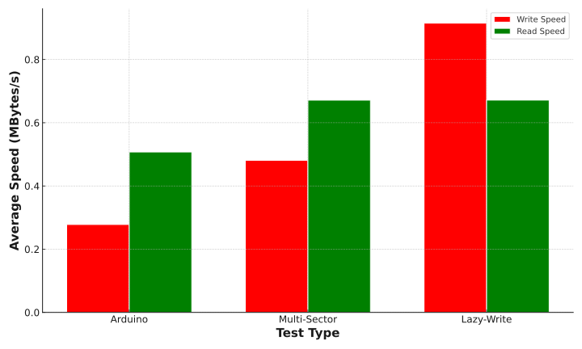

## Arduino SD Card Code - Single Sector Writing

| Type        | Test 1 (B/s) | Test 2 (B/s) | Test 3 (B/s) | Test 4 (B/s) | Test 5 (B/s) | Average (Mbits/s) | Average (MBytes/s) |
| ----------- | ------------ | ------------ | ------------ | ------------ | ------------ | ----------------- | ------------------ |
| Write Speed | 279717       | 276096       | 279594       | 279577       | 275318       | 2.22              | 0.278              |
| Read Speed  | 506918       | 506782       | 506046       | 506007       | 511699       | 4.06              | 0.507              |

## IDF SD Card Code - Multi Sector Writing

| Type        | Test 1 (B/s) | Test 2 (B/s) | Test 3 (B/s) | Test 4 (B/s) | Test 5 (B/s) | Average (Mbits/s) | Average (MBytes/s) |
| ----------- | ------------ | ------------ | ------------ | ------------ | ------------ | ----------------- | ------------------ |
| Write Speed | 476410       | 481890       | 482435       | 483092       | 481733       | 3.85              | 0.481              |
| Read Speed  | 667243       | 670885       | 671615       | 673308       | 674225       | 5.37              | 0.671              |

## IDF SD Card Code - Multi Sector Lazy Writing

| Type        | Test 1 (B/s) | Test 2 (B/s) | Test 3 (B/s) | Test 4 (B/s) | Test 5 (B/s) | Average (Mbits/s) | Average (MBytes/s) |
| ----------- | ------------ | ------------ | ------------ | ------------ | ------------ | ----------------- | ------------------ |
| Write Speed | 918150       | 915334       | 911385       | 913506       | 915925       | 7.32              | 0.915              |
| Read Speed  | 668170       | 665781       | 673559       | 674341       | 675787       | 5.37              | 0.672              |

## Comparison

# Raw SD Card Test Writing 100MB

20MHz SPI Clock

| Operation | Size (MBytes) | Duration (ms) | Speed (Mbits/s) | Speed (MBytes/s) |
| --------- | ------------- | ------------- | --------------- | ---------------- |
| Write     | 100           | 103779        | 8.08            | 1.01             |
| Read      | 100           | 62884         | 13.36           | 1.67             |

